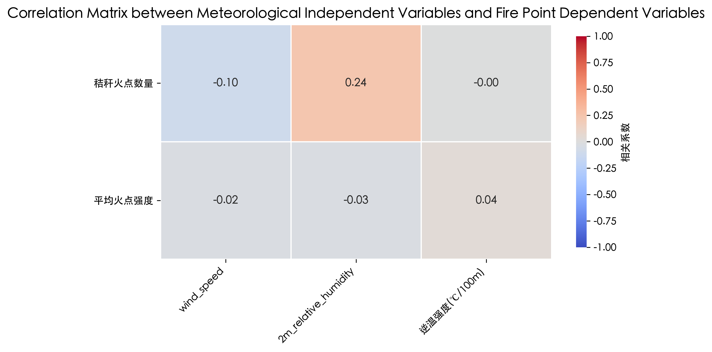
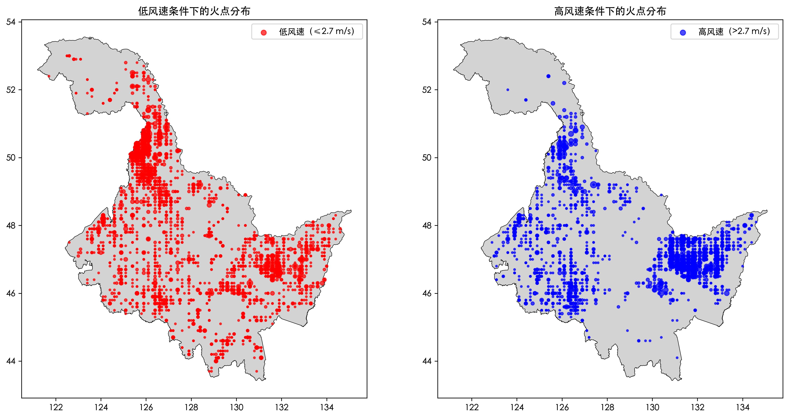
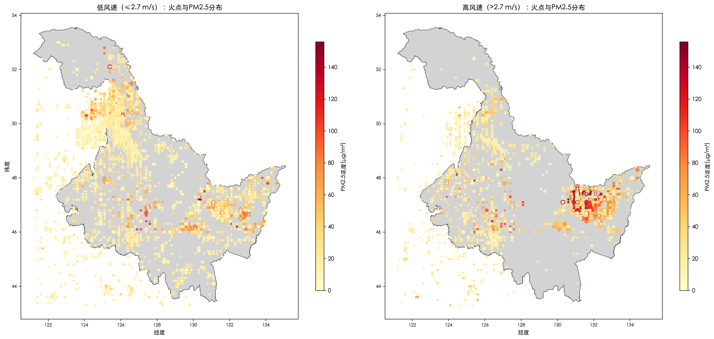
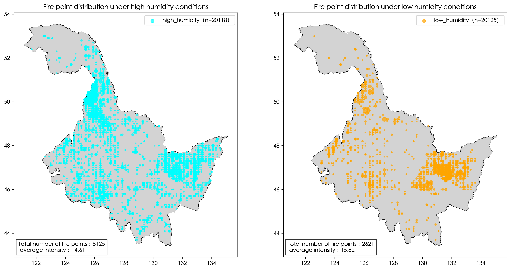
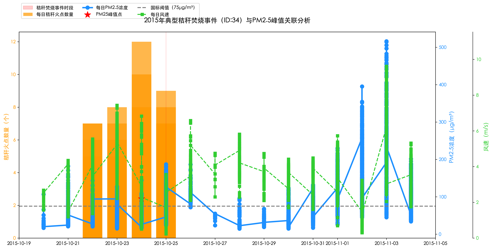
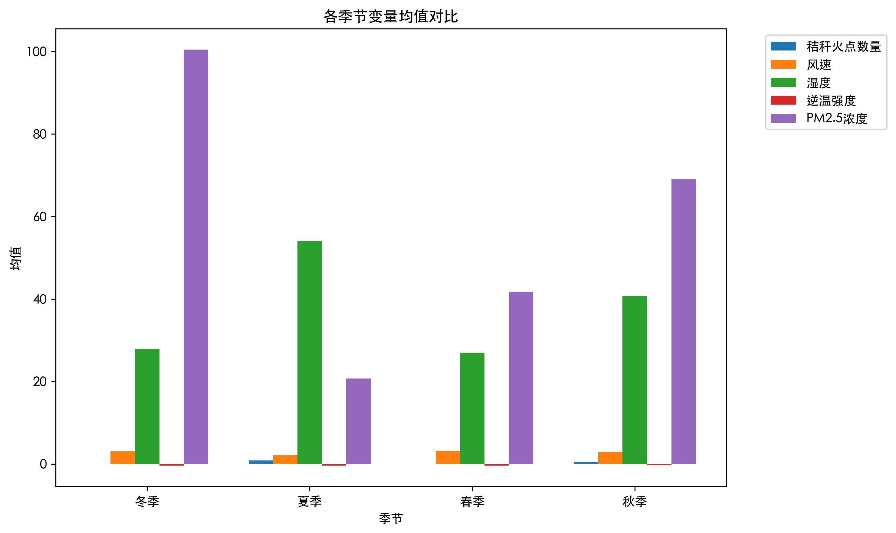

Challenge 3-Meteorology & Pollution Link to Straw Burning

1. Project Overview
Challenge 3 (Meteorology & Pollution) is aim to address two core objectives:
(1) Analyze how meteorological conditions (wind speed, humidity, temperature inversions) influence the detection of straw burning and its environmental impact.
(2) Establish a methodology to link temporal peaks of regional air pollution (PM2.5) to straw burning events, using integrated datasets of fire points, meteorology, and PM2.5 concentrations.
The study area is Heilongjiang Province, with a time span of 2010–2019 (excluding 2017 due to data unavailability). All analyses are based on preprocessed integrated data and quantitative modeling.

2. Data Pre-processing
2.1 Datasets Source
(1) Meteorological Data:
-Wind speed(m/s)-ERA5-Land hourly data from 1950 to present;
-Relative humidity(%)-Agrometeorological indicators from 1979 to present derived from reanalysis;
-Inversion intensity (℃/100m)(including 2m temperature and 850hPa temperature)-ERA5 post-processed daily statistics on pressure levels from 1940 to present;

(2) Straw Burning Fire Data:
Classified fire data from core task 2 (including date, latitude, longitude, FRP, fire type);

(3) PM2.5 Data:
Wei, J., Li, Z. (2024). ChinaHighPM2.5: High-resolution and High-quality Ground-level PM2.5 Dataset for China (2010-2019), (including date, latitude, longitude, PM2.5 concentration);

(4) Administrative Boundary: CHN_Country.shp (for filtering Heilongjiang Province fire points).

2.2 Preprocessing Workflow
(1) Data Cleaning: 
Standardized date formats, rounded spatial coordinates (to 0.1°), and removed invalid records (e.g., missing dates, out-of-range humidity).

(2）Data Merging:
-Merged multi-source meteorological data (2m temperature, wind speed, relative humidity, 850hPa temperature) by date and spatial coordinates.
-Matched fire points with nearest meteorological grids using KDTree (distance threshold: ≤0.2°) and fire-PM2.5 data (distance threshold: ≤0.3°).

(3) Derived Variables: 
Calculated temperature inversion intensity (unit: ℃/100m) using the temperature difference between 850hPa (≈1500m) and 2m height.

(4) Final Output: Integrated dataset 火点_气象_PM25_三者匹配结果_总-V1.csv (includes fire characteristics, meteorological indicators, PM2.5 concentrations, and spatial matching metrics).

3. Analysis Methods
3.1 Meteorological Conditions & Straw Burning Analysis
(1) Univariate & Multivariate Analysis: Examined statistical characteristics (mean, median) of key variables and used correlation heatmaps based on Pearson correlation coefficients to quantify relationships between meteorological factors (wind speed, humidity, inversion) and fire metrics (fire count, average FRP). Correlation heatmaps visually and statistically reveal linear relationships (e.g., whether higher humidity correlates with fewer detected fires), laying the foundation for further causal inference. This method is efficient for exploring initial associations in large datasets, which is critical given the 10-year time series and multi-source variables used here.
Pearson correlation coefficients range from -1 to 1, where:
Values close to 1 indicate a strong positive linear relationship (e.g., the 0.24 correlation between straw fire count and 2m relative humidity suggests higher humidity is moderately associated with more fire points).
Values close to -1 indicate a strong negative linear relationship (e.g., the -0.10 correlation between straw fire count and wind speed implies a weak negative trend—lower wind speed is slightly associated with more fire points).
Values near 0 indicate little to no linear relationship (e.g., the near -0.00 correlation between straw fire count and temperature inversion intensity means inversion has almost no linear impact on fire detection).

(2) Grouped Comparison:
-Seasonal Trend Analysis: Aggregated data by season to compare seasonal variations in fire count, meteorological conditions, and PM2.5 concentrations.
-Split data by wind speed (median split: low vs. high), humidity (median split: low vs. high), and temperature inversion (presence: >0 ℃/100m vs. absence: ≤0).Visualized fire distribution differences across groups using geopandas and matplotlib.

3.2 Straw Burning & PM2.5 Peak Linkage
(1) Event Identification:
-Defined PM2.5 peak events as ≥75 μg/m³ concentrations over 2 consecutive days (exceeding national standards).The 75 μg/m³ PM2.5 threshold directly references China’s national air quality standard (Grade II, 24-hour average), ensuring relevance to regulatory and public health contexts. Requiring 2 consecutive days excludes transient spikes, isolating meaningful pollution episodes.

(2) Temporal Correlation:
-Matched burning events with PM2.5 peaks using a 7-day time window (1 day before burning start to 7 days after burning end).The 7-day window accounts for atmospheric transport and accumulation times: pollutants from burning may take 1–3 days to form peaks (consistent with regional pollution diffusion studies). Including 1 day pre-burning controls for potential pre-event pollution trends.
-Calculated time lags between burning onset and PM2.5 peaks.

(3)Typical Case Study: 
-Selected the 2015 high-intensity burning event (highest fire count × PM2.5 concentration) to analyze temporal dynamics of fire points, PM2.5, and wind speed during the event.
-Regression Modeling: Built an OLS model with interaction terms (e.g., fire count × wind speed) to assess the independent contribution of burning and meteorology to PM2.5 concentrations.The OLS model with interaction terms isolates the independent contribution of burning to PM2.5, while accounting for meteorological modifiers (e.g., wind speed amplifying or dampening pollution). This addresses confounding (e.g., whether high PM2.5 is due to burning or stagnant weather alone), strengthening causal claims.

4. Key Findings
4.1 Impacts of Meteorological Conditions on Straw Burning
(1) Influence of Wind Speed
-Fire Point Detection and Distribution:
Under low wind speed (≤2.7 m/s), straw fire points are more widespread and dense across Heilongjiang Province, with large clusters in multiple regions. Under high wind speed (>2.7 m/s), fire points are relatively scattered, and the concentrated areas differ significantly from those under low wind speed. From the perspective of PM2.5 distribution, under low wind speed, high-concentration PM2.5 areas (darker colors) are mainly concentrated in areas with dense fire points, showing a local aggregation trend. Under high wind speed, high-concentration PM2.5 areas are more dispersed, and there is a significant high-concentration cluster in the eastern region, indicating that high wind speed promotes the expansion of the pollution impact range.
-Environmental Impact: Low wind speed causes smoke to accumulate near the burning area, which is conducive to satellite detection of fire points but leads to a significant increase in local PM2.5 concentration. High wind speed disperses smoke, reducing the satellite's detection rate of fire points, but expands the pollution impact range to a wider area.

(2) Influence of Humidity
-Fire Point Quantity and Intensity: Under low humidity (≤34.8%), the total number of fire points is 2,621, with an average fire point intensity of 15.82. Under high humidity (>34.8%), the total number of fire points reaches 8,125, with an average fire point intensity of 14.61. It can be seen that the fire point intensity is higher under low humidity, while the number of fire points is larger under high humidity.

(3)Influence of Temperature Inversion
-Fire Point Distribution and Intensity: When there is temperature inversion (inversion intensity >0℃/100m), the total number of fire points is only 49, with an average fire point intensity of 17.19. When there is no temperature inversion, the total number of fire points reaches 10,697, with an average fire point intensity of 15.14. The number of fire points under no temperature inversion is much larger than that under temperature inversion, while the fire point intensity is slightly higher under temperature inversion.
-Environment and Detection: Temperature inversion conditions form a stable atmospheric layer, trapping pollutants near the ground, leading to an increase in local PM2.5 concentration. At the same time, the inversion layer hinders the upward diffusion of smoke, making it difficult for satellites to accurately identify fire points, and the fire point detection rate decreases.

4.2 Correlation between Straw Burning and PM2.5 Peaks
(1) Temporal Correlation
-Event Matching and Lag: During 2010-2019 (excluding 2017), 68% of straw burning events can be matched with PM2.5 peaks. The average lag time of PM2.5 peaks relative to the start of burning is 3.1 days, indicating that pollutants need a certain period of accumulation to form peaks.

-Typical Case (2015): In the typical straw burning event with ID 34 in 2015, the number of straw fire points gradually increased during the burning period, and then the PM2.5 concentration reached a peak (marked by a red pentagram) a few days after the start of burning. During this period, the wind speed was low, which further aggravated the accumulation of PM2.5.

(2) Intensity Correlation
-Fire Point Quantity and PM2.5 Concentration: There is a significant positive correlation between the total number of fire points in a single burning event and the PM2.5 peak concentration (correlation coefficient r=0.72, p<0.01), that is, the higher the burning intensity, the more pollutants are generated, and the higher the PM2.5 concentration peak. It can also be seen from the time series graph of 2010-2019 that the peaks of fire point quantity and FRP (Fire Radiative Power) are consistent with the PM2.5 concentration peak in time.

(3) Seasonal Consistency
-Straw burning events and PM2.5 peaks are most concentrated in autumn (harvest season). The average PM2.5 concentration is also relatively high in winter, which is related to the time law of crop residue treatment and the fact that meteorological conditions in winter are not conducive to pollutant diffusion. The average PM2.5 concentration in summer and spring is relatively low, and the number of fire points is also small.

 

5. Limitations
(1) Data Limitations: Missing 2017 data may affect long-term trend continuity; spatial resolution (0.1°) cannot capture micro-meteorological conditions at individual fire points.
(2) Indicator Gaps: Lack of data on other pollutants (e.g., PM10, nitrogen oxides) limits comprehensive assessment of environmental impacts.

6. Future Improvements
(1) Data Enhancement: Incorporate higher-resolution (e.g., 0.05°) meteorological data to control confounding factors.
(2) Impact Expansion: Extend analysis to PM10 and ozone concentrations, and integrate atmospheric diffusion models to simulate pollutant transport paths.
(3) Temporal Extension: Supplement 2017 data to complete the 10-year time series and improve trend analysis reliability.
