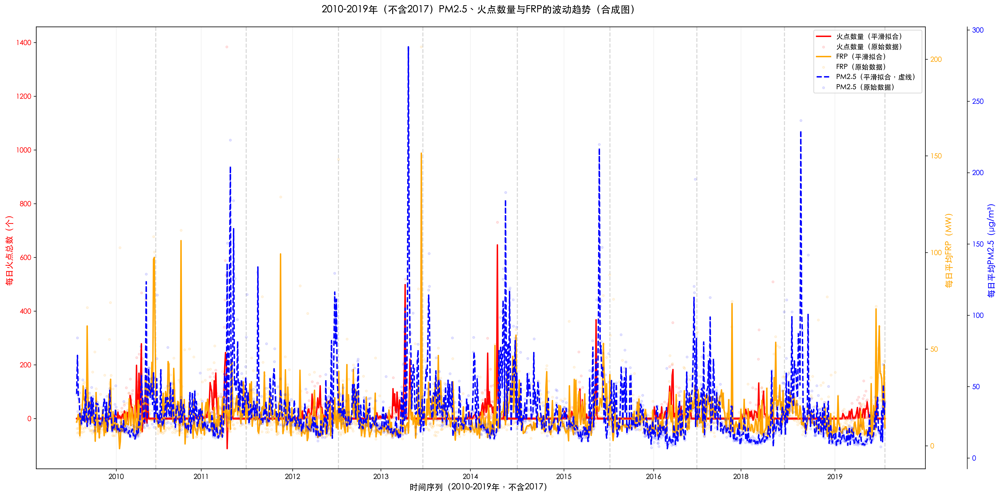

# 5020 Mini-Project

## 1.Core Tasks 1 & 3: Spatiotemporal Patterns & Long-Term Trends of Fire Activity

This section focuses on Core Task 1 (Spatio-Temporal Patterns of Fire Activity) and Core Task 3 (Long-Term Spatio-Temporal Trends, 2010–2019) of the project.Both tasks target Heilongjiang Province (China’s major grain-producing region) and leverage remote sensing, geospatial, and phenological data to address.

### 1.1Data Preparation
#### Preprocessing Workflow
To ensure consistency and accuracy across analyses, the following preprocessing steps were implemented (refer to [Task1.py](https://github.com/xhe628/5020mini-project/blob/main/Task1.py) & [Task3.py](https://github.com/xhe628/5020mini-project/blob/main/Task3.py)):
#### Coordinate System Unification: 
Convert all geospatial data (e.g., county boundaries, fire points) to EPSG:4326 (WGS84)—a universal geographic coordinate system that enables cross-dataset spatial matching.
#### Time Dimension Extraction: 
Derive year, month, week (ISO week), and season from MODIS fire acquisition dates (acq_date). Seasonal division follows meteorological classification method:
Bins: [0,2,5,8,11,12] → Labels: Winter (Dec-Feb), Spring (Mar-May), Summer (Jun-Aug), Autumn (Sep-Nov)
#### Study Area Filtering: 
Restrict fire points to Heilongjiang Province using dual validation: Spatial bounds: Longitude (121°E–135°E) & Latitude (43°N–53°N); Administrative join: Spatial overlap with Heilongjiang’s county boundaries (CHN_County.shp) to exclude non-provincial fire points.

### 1.2Reasearch Method
#### Core Task 1: Spatiotemporal Patterns of Fire Activity
The methodology is divided into temporal pattern analysis (to address seasonality/hotspot weeks) and spatial pattern analysis (to address geographic distribution).
#### Temporal Pattern Analysis
#### (1) Monthly & Seasonal Distribution
- Step 1: Aggregate fire counts by month and season for Heilongjiang Province (filtered via preprocessing).
- Step 2: Visualize results with: Monthly distribution: Bar chart (x=month, y=fire count) to identify peak months (e.g., post-harvest September–October). Seasonal distribution: Pie chart (with percentage labels) to quantify fire share across seasons (e.g., Autumn as the dominant burning season).

#### (2)Hotspot Weeks Identification
To go beyond "simple monthly counts" (Doc 1 §1-35), we use a data-driven threshold to define hotspot weeks:
- Step 1: Calculate average weekly fire counts (10-year average: 2010–2019) by grouping data by year and week.
- Step 2: Set the hotspot threshold as the 90th percentile of average weekly counts (avoids subjective peak definition).
- Step 3: Flag weeks with average counts ≥ threshold as "hotspot weeks" and visualize with a line plot (x=week number, y=average count) + red scatter points for hotspots.

#### Spatial Pattern Analysis
#### (1) Geographic Distribution of Fire Types
- Step 1: Classify fires into 4 types (using crop phenological data):
Maize straw burning, Wheat straw burning, Mixed crop burning, Non-agricultural fires.
- Step 2: Overlay fire points on Heilongjiang’s county boundaries (light gray base map) using a scatter plot. Use high-contrast colors for fire types to enable clear spatial differentiation: Maize: #ff6b6b (red), Wheat: #9b59b6 (purple), Non-agricultural: #4ecdc4 (teal), Mixed: #ffa500 (orange).

#### (2) County-Level Fire Density
- Step 1: Perform a spatial join between Heilongjiang’s counties and fire points to count fires per county.
- Step 2: Visualize density with a choropleth map (colormap: YlOrRd), where darker red indicates higher fire counts (highlights "hotspot counties").


## Task2：To what extent can the observed fire hotspots be attributed to the post-harvest burning of corn and wheat?

The core issue of this task is to design a robust methodology for classifying fires based on the relative location of the fire occurrence site and the farmland, as well as the relative timing of the fire occurrence and the harvest season. The final output should include quantitative estimates (for example: "We classify X% of the fires as possible agricultural burns") and maps showing different types of fires.

### 2.1 Data Extraction

First, download the files that correspond to the crop maturity for different dates (refer to: Heilongjiang_Maize_MA_2010.tif) 
Then, using Python, the rasterio library is utilized to extract the DOY value corresponding to each grid point's position for each grid point and save it into an Excel file.

```python
import rasterio
from rasterio.transform import rowcol

# 2. 作物栅格路径（玉米/小麦2010-2019年，保持不变）
corn_raster_paths = {
    2010: r"D:\AAA1assignment\DATA\Maize\Maize2010.tif",
    2011: r"D:\AAA1assignment\DATA\Maize\Maize2011.tif",
    2012: r"D:\AAA1assignment\DATA\Maize\Maize2012.tif",
    2013: r"D:\AAA1assignment\DATA\Maize\Maize2013.tif",
    2014: r"D:\AAA1assignment\DATA\Maize\Maize2014.tif",
    2015: r"D:\AAA1assignment\DATA\Maize\Maize2015.tif",
    2016: r"D:\AAA1assignment\DATA\Maize\Maize2016.tif",
    2017: r"D:\AAA1assignment\DATA\Maize\Maize2017.tif",
    2018: r"D:\AAA1assignment\DATA\Maize\Maize2018.tif",
    2019: r"D:\AAA1assignment\DATA\Maize\Maize2019.tif"
}

## 三、工具函数定义（保持不变）
def crs_transform(lon, lat, src_crs="EPSG:4326", dst_crs="EPSG:32651"):
    """坐标转换：WGS84→目标CRS"""
    transformer = Transformer.from_crs(src_crs, dst_crs, always_xy=True)
    x, y = transformer.transform(lon, lat)
    return x, y


def get_crop_maturity(fire_x, fire_y, crop_type, year, crop_raster_paths, debug=False):
    """提取火点位置的作物成熟DOY"""
    crop_cfg = CROP_CONFIG[crop_type]
    raster_path = crop_raster_paths.get(year, None)

    if not raster_path or not os.path.exists(raster_path):
        if debug:
            print(f"警告：{crop_type}{year}年栅格不存在 → {raster_path}")
        return None

    try:
        with rasterio.open(raster_path) as src:
            row, col = rowcol(src.transform, fire_x, fire_y)
            if crop_type == "小麦" and debug:
                print(f"小麦{year}年栅格：火点行列号=({row},{col})，栅格尺寸=({src.height},{src.width})")

            if 0 <= row < src.height and 0 <= col < src.width:
                raw_doy = src.read(1)[row, col]
                if debug:
                    print(f"{crop_type}{year}年栅格：该位置原始值={raw_doy}，NoData={crop_cfg['nodata']}")

                # 过滤无效值
                if not any(np.isclose(raw_doy, nd, atol=1e-30) for nd in crop_cfg["nodata"]) and not np.isnan(raw_doy):
                    return int(raw_doy)
        return None
    except Exception as e:
        if debug:
            print(f"读取{crop_type}{year}年栅格错误 → {str(e)}")
        return None


```

The library that was called was:

```python
import pandas as pd
import numpy as np
import rasterio
from rasterio.transform import rowcol

```

Furthermore, "corn_raster_paths" should be replaced with the actual path of the file.


### 2.2 Data Reading

Then, read the file data of the location where the fire occurred. 
Import the corresponding packages in advance

```python
import pandas as pd
import numpy as np
```

```python
def is_in_window(fire_doy, crop_maturity_doy, window_days=WINDOW_DAYS):
    """判断火点是否在「成熟期前window_days天 到 后window_days天」内"""
    if pd.isna(crop_maturity_doy):
        return False

    # 窗口期范围：成熟前window_days天 → 成熟后window_days天
    window_start = crop_maturity_doy - window_days
    window_end = crop_maturity_doy + window_days

    # 处理跨年情况
    if window_start < 1:
        return (fire_doy >= window_start) or (fire_doy <= window_end)
    elif window_end > 365:
        return (fire_doy >= window_start) or (fire_doy <= (window_end - 365))
    else:
        return window_start <= fire_doy <= window_end


```


### 2.3 Classify fires

Classify the fires according to the corresponding set period during which the crops are burning.

```python
### 步骤4：火灾分类与分年定量估算（保持不变）
print("\n=== 步骤4：2010-2019年火灾分类与分年定量估算 ===")
# 计算火灾类型（全量数据）
hlj_fires["火灾类型"] = hlj_fires.apply(classify_fire, axis=1)

# 1. 总统计（2010-2019年）
fire_count = hlj_fires["火灾类型"].value_counts()
fire_frp = hlj_fires.groupby("火灾类型")["frp"].sum()
total_count = len(hlj_fires)
total_frp = hlj_fires["frp"].sum()
agri_types = ["玉米秸秆焚烧", "小麦秸秆焚烧", "混合作物焚烧"]
agri_count = sum(fire_count.get(t, 0) for t in agri_types)
agri_frp = sum(fire_frp.get(t, 0) for t in agri_types)
agri_count_ratio = (agri_count / total_count) * 100 if total_count > 0 else 0
agri_frp_ratio = (agri_frp / total_frp) * 100 if total_frp > 0 else 0

print(f"\n=== 黑龙江省火灾总分类结果（2010-2019年） ===")
print(f"1. 总火点数量：{total_count} 个 | 总FRP：{total_frp:.2f} MW")
print("\n各类型火灾详情：")
for fire_type in agri_types + ["非农业火灾"]:
    cnt = fire_count.get(fire_type, 0)
    frp_val = fire_frp.get(fire_type, 0)
    print(
        f"- {fire_type}：{cnt} 个（{cnt / total_count * 100:.2f}%）| FRP {frp_val:.2f} MW（{frp_val / total_frp * 100:.2f}%）"
    )
print(f"\n农业焚烧总占比：")
print(f"- 数量占比：{agri_count_ratio:.2f}% | FRP占比：{agri_frp_ratio:.2f}%")

# 2. 分年份统计
print("\n=== 各年份火灾分类结果 ===")
yearly_fire_stats = []
for year in ANALYSIS_YEARS:
    yearly_fires = hlj_fires[hlj_fires["year_left"] == year]
    if len(yearly_fires) == 0:
        continue
    # 各类型数量
    cnt = yearly_fires["火灾类型"].value_counts()
    # 各类型FRP
    frp = yearly_fires.groupby("火灾类型")["frp"].sum()
    # 农业焚烧合计
    yearly_agri_count = sum(cnt.get(t, 0) for t in agri_types)
    yearly_agri_frp = sum(frp.get(t, 0) for t in agri_types)
    # 保存统计
    yearly_fire_stats.append({
        "年份": year,
        "总火点": len(yearly_fires),
        "玉米秸秆焚烧（个）": cnt.get("玉米秸秆焚烧", 0),
        "小麦秸秆焚烧（个）": cnt.get("小麦秸秆焚烧", 0),
        "混合作物焚烧（个）": cnt.get("混合作物焚烧", 0),
        "非农业火灾（个）": cnt.get("非农业火灾", 0),
        "农业焚烧占比（%）": (yearly_agri_count / len(yearly_fires)) * 100 if len(yearly_fires) > 0 else 0,
        "农业焚烧FRP（MW）": yearly_agri_frp
    })
```


### 2.4Save the results into an Excel file

```python
# 2. 分年份统计
print("\n=== 各年份火灾分类结果 ===")
yearly_fire_stats = []
for year in ANALYSIS_YEARS:
    yearly_fires = hlj_fires[hlj_fires["year_left"] == year]
    if len(yearly_fires) == 0:
        continue
    # 各类型数量
    cnt = yearly_fires["火灾类型"].value_counts()
    # 各类型FRP
    frp = yearly_fires.groupby("火灾类型")["frp"].sum()
    # 农业焚烧合计
    yearly_agri_count = sum(cnt.get(t, 0) for t in agri_types)
    yearly_agri_frp = sum(frp.get(t, 0) for t in agri_types)
    # 保存统计
    yearly_fire_stats.append({
        "年份": year,
        "总火点": len(yearly_fires),
        "玉米秸秆焚烧（个）": cnt.get("玉米秸秆焚烧", 0),
        "小麦秸秆焚烧（个）": cnt.get("小麦秸秆焚烧", 0),
        "混合作物焚烧（个）": cnt.get("混合作物焚烧", 0),
        "非农业火灾（个）": cnt.get("非农业火灾", 0),
        "农业焚烧占比（%）": (yearly_agri_count / len(yearly_fires)) * 100 if len(yearly_fires) > 0 else 0,
        "农业焚烧FRP（MW）": yearly_agri_frp
    })
# 转换为DataFrame并打印
yearly_fire_df = pd.DataFrame(yearly_fire_stats)
print(yearly_fire_df.to_string(index=False))
# 保存分年统计结果
yearly_fire_df.to_csv(
    os.path.join(OUTPUT_DIR, "各年份火灾分类统计.csv"),
    index=False, encoding="utf-8-sig"
)
```

The classification of fires is as follows: 


### 2.5 the results for analysis


Complete code reference: task2.py


## Core Task 3: Long-Term Trends (2010–2019)
The methodology focuses on county-level trend quantification and provincial-level trend overview to identify reductions or shifts in straw burning.

### 3.1County-Level Trend Calculation
- Step 1: Filter data to 2010–2019 and split by fire type (maize straw, wheat straw, non-agricultural fires).
- Step 2: Compute annual fire counts per county (group by 县级 and year).
- Step 3: Quantify trends using linear regression: For each county’s annual count series, calculate the trend slope (via scipy.stats.linregress). The slope reflects the direction (positive=increase, negative=decrease) and magnitude of change.
- Step 4: Classify trends into 3 categories (objective slope thresholds to ensure consistency):

| Trend Category       | Slope Range        | Interpretation                                         |
|----------------------|--------------------|--------------------------------------------------------|
| Significant Decrease | < -0.5             | Annual fire counts decline noticeably over 10 years    |
| Basically Stable     | -0.5 ≤ slope ≤ 0.5 | Annual fire counts show no clear upward/downward trend |
| Significant Increase | > 0.5              | Annual fire counts rise noticeably over 10 years       |

### 3.2Provincial-Level Trend Overview
- Step 1: Aggregate annual fire counts by fire type (province-wide) for 2010–2019.
- Step 2: Visualize trends with line plots (x=year, y=fire count) + linear fit lines (dashed) to highlight overall direction.
- Step 3: Identify turning points by inspecting deviations from the linear fit.

  
### 3.3Result of Analysis
#### Monthly Distribution & Seasonal Distribution


- October is the absolute peak for fires, while months like January, June, July, and December have very few events. This aligns with post-harvest seasons (autumn for corn/wheat) when farmers often burn residues to clear fields.
- Spring (March–May) and Autumn (September–November) dominate, accounting for 46.0% and 45.7% of total fires respectively. The burning of straw in Spring is mainly due to the fact that farmers need to clear the remaining straw and weeds in the fields before sowing to ensure a smooth planting process and to reduce the impact of pests and diseases on the new crop season. Summer (4.3%) and Winter (4.0%) have minimal fire activity since summer is growing season and winter is too cold for widespread burning.

### 3.4 Distribution of Fires


- By fire type: Corn straw burning is highly concentrated in northern Heilongjiang, which makes sense since this region is a major corn-producing area. In contrast, non-agricultural fires are much more widespread across the province—no single region dominates.  
- Hotspot counties: The density heatmap highlights that dark red counties are fire "hotspots" with the highest fire counts. These counties should be prioritized for targeted prevention measures, like increased monitoring during harvest seasons. 

#### 3.5Weekly Distribution and Hotspot Weeks 


-  there are two distinct clusters of "hotspot weeks" each year—specifically Week 14(around the time of Spring farming season) and Week 43(coincides precisely with the post-harvest dates). These weeks are critical for fire control, as they see over 2,033 fires on average, far above other weeks. 

#### 3.6County-level Interannual Trend of Fires (2010–2019) 


At the county level:  
- Corn straw burning: Most counties show a "significant decrease" (marked in green). This suggests that policies targeting corn residue burning—like bans or alternative disposal support—have been effective in reducing such fires.  
- Wheat straw burning: Trends are mixed. Some counties show a decrease, others stay "basically stable" (orange), and a small number even increase (red). This inconsistency may reflect varying enforcement of straw burning rules across different wheat-growing areas.  
- Non-agricultural fires: The opposite trend—most counties show a "significant increase" (red). We’ll need further investigation to understand why, but possible factors include more industrial activity or accidental human-caused fires.

#### 3.7Overall Trend and Linear Fitting (2010–2019) 


For overall long-term trends,we find:
1. Corn straw burning:
  - Turning point: After reaching a peak in 2011, the number of fires has continued to decline, with a linear slope of -321.32, and the downward trend is significant.
  - Reason analysis:
    - Policy-driven: Starting from 2011, Heilongjiang Province gradually strengthened the policy of prohibiting straw burning, and also introduced subsidies for straw utilization (such as per-plot subsidies for straw returning to the soil, and support for biomass power generation projects), forcing farmers to reduce burning behavior.
    - Technological substitution: Promoting technologies such as straw returning to the soil, straw feed conversion, and biomass fuel, transforming straw from "burned waste" into "usable resources", reducing the demand for burning.
    - Regulatory strengthening: The environmental protection department has intensified inspections and penalties, using satellite remote sensing monitoring to precisely locate burning points, and handling violations "as soon as they are discovered", creating an effective deterrent.
2.  Wheat straw burning:
  - Turning point: The trend fluctuated significantly (such as the trough in 2013 and the recovery in 2016), the linear slope was -7.68, there was a slight overall decline but the stability was insufficient.
  - Reason analysis:
    - Policy implementation differences: The scale of wheat cultivation is smaller than that of corn. The implementation intensity and resource investment of local policies on prohibiting straw burning in wheat areas are weaker than those for corn, resulting in unstable control effects.
    - Limited utilization mode: The industrialized utilization of wheat straw (such as as feed, weaving) has not yet formed a large-scale and stable industrial chain. Farmers' alternative solutions for handling straw are insufficient, and the burning behavior is prone to fluctuate with planting income and market demand.
    - Climate and agricultural impact: If the wheat harvest period encounters rainy weather, the straw becomes humid and difficult to burn, temporarily reducing the number of fires (such as the trough in 2013 or related to this).
3. Non-agricultural Fires:
  - Turning point:After 2017, the growth accelerated, with a linear slope of 1129.25, and the upward trend was obvious.
  - Reason analysis:
    - Economic activity expansion: The industrialization and urbanization process in Heilongjiang Province has accelerated, leading to an increase in industrial production, construction activities, and urban infrastructure projects. This has resulted in more non-agricultural fire scenarios (such as open flames at construction sites and industrial waste incineration).
    - Weak regulatory system: Non-agricultural fires involve multiple industries and are scattered in various scenarios (such as industry, commerce, and domestic use of fire), making the supervision much more difficult than agricultural straw burning. The existing control measures (such as fire inspections) are unable to cover all areas, causing the number of fires to increase in tandem with economic activities.
    - Human factors combined: Urbanization leads to population concentration, and the management of life-related open flames (such as outdoor barbecues and sacrificial fires) becomes more challenging, further increasing the incidence of non-agricultural fires.

#### 3.8Rationale for Analytical Choices
##### Choices for Task 1 (Spatio-Temporal Patterns)
Dual study area filtering (bounds + admin join): Bounds alone may include non-Heilongjiang areas (e.g., adjacent Inner Mongolia); administrative join ensures 100% provincial accuracy.

High-contrast colors for fire types: Colors like red (maize) and teal (non-agricultural) have strong visual differentiation—critical for identifying spatial clusters (e.g., maize burning concentrated in western Heilongjiang).

### 3.9Choices for Task 3 (Long-Term Trends)
Linear regression for trend slope: Linear regression quantifies direction and magnitude of change (unlike moving averages, which smooth trends). A slope of -1.2, for example, means 1.2 fewer fires per year—actionable for policy evaluation.

Slope thresholds (-0.5 / 0.5): Thresholds are calibrated to 10-year data. A slope of ±0.5 translates to ±5 fires over 10 years—large enough to be a "significant" shift (not noise).


## Core Task 4 & Challenge 1: Comprehensive Comparison and FRP Analysis of Agricultural vs Non-agricultural Fires  

This section focuses on **Core Task 4 (Comprehensive Analysis of Agricultural vs Non-agricultural Fires)** and **Challenge 1 (Fire Radiative Power Analysis)**.  
Both tasks extend the prior spatiotemporal analysis to compare **fire characteristics**, including **intensity**, **seasonality**, and **diurnal distribution**, aiming to uncover the distinct behavioral and environmental patterns between agricultural and non-agricultural fire events in Heilongjiang Province.

## 4.1Data Preparation  

### Preprocessing Workflow  

The dataset integrates multi-year MODIS active fire data (2010–2019) with spatial and temporal metadata.  
To ensure analytical consistency, the following preprocessing pipeline was applied (refer to [`Task4&challenge1.py`](https://github.com/xhe628/5020mini-project/blob/main/task4%26challenge1.ipynb)):  

---

## 4.2Research Method  

### Core Task 4: Comprehensive Comparison of Agricultural vs Non-agricultural Fires  

The analysis focuses on three major dimensions: **fire intensity**, **monthly pattern**, and **hourly distribution**.  

#### (1) Fire Intensity Analysis  
- **Indicator:** Fire Radiative Power (FRP) was selected as the quantitative measure of fire energy output and intensity.  
- **Method:**  
  - Calculate summary statistics (mean, median, standard deviation, and 90th percentile) for FRP by fire type.  
  - Conduct a **t-test** and **Cohen’s d** effect size analysis to determine statistical significance between agricultural and non-agricultural FRP distributions.  
  - Visualize with kernel density estimation (KDE) and boxplots.  
- **Interpretation Basis:**  
  FRP directly corresponds to combustion energy; thus, higher FRP indicates larger, more destructive fires.  

#### (2) Monthly Pattern Analysis  
- **Purpose:** Identify seasonal cycles of agricultural burning vs non-agricultural fire occurrence.  
- **Method:**  
  - Aggregate fire counts by month (2010–2019).  
  - Normalize to percentages to eliminate interannual bias.  
  - Visualize via side-by-side bar charts for agricultural vs non-agricultural fires.  
- **Key Observation Metric:** Peak months correspond to harvest or dry seasons when fire occurrence probability is highest.
  
#### (3) Hourly Distribution Analysis  
- **Purpose:** Investigate diurnal burning behavior and potential human influence.  
- **Method:**  
  - Extract the hour from MODIS acquisition times.  
  - Compute and plot normalized hourly frequency for both fire categories.  
  - Interpret concentration windows (e.g., nighttime vs daytime).  


### 4.3Challenge 1: Fire Radiative Power (FRP) Comparative Analysis  

To extend the Task 4 findings, Challenge 1 quantitatively explores **FRP variations across agricultural and non-agricultural fires**, aiming to understand their environmental impact and energy characteristics.  

#### Steps:  
1. Filter the dataset by fire type.  
2. Compute descriptive FRP statistics (mean, median, max, standard deviation).  
3. Compare FRP distributions visually and statistically (KDE + t-test).  
4. Interpret implications for fire management and resource allocation.  

---


### 4.4Result of Analysis  

#### Task 4 Results Summary  
#### 🔥Fire Intensity  
- **Agricultural Fires:**  
  - Median FRP ≈ **8–9**, indicating **low-intensity, small-scale burns**.  
  - Occasional maize-burning events exhibit higher FRP spikes, but overall remain mild.  
- **Non-agricultural Fires:**  
  - Median FRP ≈ **10.8**, reaching up to **1824**, revealing **high-intensity, large-scale events**.  
  - Statistically significant difference between categories (**p < 0.01**, strong effect size).  
- **Implication:**  
  Agricultural fires, while numerous, contribute less to total radiative energy release.  
  Non-agricultural fires, though fewer, release disproportionately high energy, implying greater environmental and economic risk.

#### 📆 Monthly Pattern  
- **Agricultural fires:** Concentrated between **July and October**, aligning perfectly with **harvest seasons** and **straw-burning periods**.  
- **Non-agricultural fires:** Exhibit a **bimodal distribution** — peaks in **spring (March–April)** and **autumn (October)** — reflecting **multiple ignition sources**, including industrial, accidental, and land-clearing fires.  
- **Implication:**  
  Agricultural fires are **strongly seasonal and policy-sensitive**, while non-agricultural fires reflect **broader socioeconomic and climatic variability**.  

#### ⏰ Hourly Distribution  
- **Agricultural fires:**  
  - Concentrated during **nighttime (2–5 a.m.)**, peaking around **4 a.m.**  
  - Suggests **intentional nighttime burning** behavior to avoid regulation and detection.  
- **Non-agricultural fires:**  
  - Distributed **uniformly throughout the day**, indicating **diverse and less-controlled ignition sources**.  
- **Implication:**  
  Temporal fire control policies should prioritize nighttime satellite monitoring and targeted public awareness in rural regions.  

📊 **Figure. Fire Comparison**  


### 4.5Challenge 1 Results Summary  

 p=0.0000, Cohen's d=-0.063
| Category | Average FRP | Median FRP | High Intensity Ratio |
|-----------|------------|-------------|-----------|
| Wheat | 14.28 | 8.80 | 3.5% |
| Maize | 17.61 | 8.00 | 3.9% |
| Non-agricultural Fires | 18.42 | 10.80 | 6.1% |


📊 **Figure. Summary Comparison of Fire Characteristics**  


 **Overall Interpretation:**  
- **Agricultural fires** are **frequent but low-intensity**, tightly linked to **harvest cycles** and **localized human practices**.  
- **Non-agricultural fires** are **sporadic but highly destructive**, reflecting **industrial activity**, **urban expansion**, and **climatic vulnerability**.  

These insights support the need for **dual-strategy fire management**:  
1. **Preventive education and policy enforcement** in rural agricultural zones.  
2. **Enhanced detection and emergency response** for high-intensity non-agricultural fires.   


## Challenge 3-Meteorology & Pollution Link to Straw Burning

## 5.1Project Overview

Challenge 3 (Meteorology & Pollution) is aim to address two core objectives:
(1) Analyze how meteorological conditions (wind speed, humidity, temperature inversions) influence the detection of straw burning and its environmental impact.
(2) Establish a methodology to link temporal peaks of regional air pollution (PM2.5) to straw burning events, using integrated datasets of fire points, meteorology, and PM2.5 concentrations.
The study area is Heilongjiang Province, with a time span of 2010–2019 (excluding 2017 due to data unavailability). All analyses are based on preprocessed integrated data and quantitative modeling.


## 5.2Data Pre-processing

### Datasets Source

(1) Meteorological Data:
-Wind speed(m/s)-ERA5-Land hourly data from 1950 to present;
-Relative humidity(%)-Agrometeorological indicators from 1979 to present derived from reanalysis;
-Inversion intensity (℃/100m)(including 2m temperature and 850hPa temperature)-ERA5 post-processed daily statistics on pressure levels from 1940 to present;

(2) Straw Burning Fire Data:
Classified fire data from core task 2 (including date, latitude, longitude, FRP, fire type);

(3) PM2.5 Data:
Wei, J., Li, Z. (2024). ChinaHighPM2.5: High-resolution and High-quality Ground-level PM2.5 Dataset for China (2010-2019), (including date, latitude, longitude, PM2.5 concentration);

(4) Administrative Boundary: CHN_Country.shp (for filtering Heilongjiang Province fire points).


### Preprocessing Workflow

(1) Data Cleaning: 
Standardized date formats, rounded spatial coordinates (to 0.1°), and removed invalid records (e.g., missing dates, out-of-range humidity).

(2）Data Merging:
-Merged multi-source meteorological data (2m temperature, wind speed, relative humidity, 850hPa temperature) by date and spatial coordinates.
-Matched fire points with nearest meteorological grids using KDTree (distance threshold: ≤0.2°) and fire-PM2.5 data (distance threshold: ≤0.3°).

(3) Derived Variables: 
Calculated temperature inversion intensity (unit: ℃/100m) using the temperature difference between 850hPa (≈1500m) and 2m height.

(4) Final Output: Integrated dataset 火点_气象_PM25_三者匹配结果_总-V1.csv (includes fire characteristics, meteorological indicators, PM2.5 concentrations, and spatial matching metrics).


## 5.3Analysis Methods

#### Meteorological Conditions & Straw Burning Analysis

(1) Univariate & Multivariate Analysis: Examined statistical characteristics (mean, median) of key variables and used correlation heatmaps based on Pearson correlation coefficients to quantify relationships between meteorological factors (wind speed, humidity, inversion) and fire metrics (fire count, average FRP). Correlation heatmaps visually and statistically reveal linear relationships (e.g., whether higher humidity correlates with fewer detected fires), laying the foundation for further causal inference. This method is efficient for exploring initial associations in large datasets, which is critical given the 10-year time series and multi-source variables used here.
Pearson correlation coefficients range from -1 to 1, where:
Values close to 1 indicate a strong positive linear relationship (e.g., the 0.24 correlation between straw fire count and 2m relative humidity suggests higher humidity is moderately associated with more fire points).
Values close to -1 indicate a strong negative linear relationship (e.g., the -0.10 correlation between straw fire count and wind speed implies a weak negative trend—lower wind speed is slightly associated with more fire points).
Values near 0 indicate little to no linear relationship (e.g., the near -0.00 correlation between straw fire count and temperature inversion intensity means inversion has almost no linear impact on fire detection).


(2) Grouped Comparison:
-Seasonal Trend Analysis: Aggregated data by season to compare seasonal variations in fire count, meteorological conditions, and PM2.5 concentrations.
-Split data by wind speed (median split: low vs. high), humidity (median split: low vs. high), and temperature inversion (presence: >0 ℃/100m vs. absence: ≤0).Visualized fire distribution differences across groups using geopandas and matplotlib.


### Straw Burning & PM2.5 Peak Linkage

(1) Event Identification:
-Defined PM2.5 peak events as ≥75 μg/m³ concentrations over 2 consecutive days (exceeding national standards).The 75 μg/m³ PM2.5 threshold directly references China’s national air quality standard (Grade II, 24-hour average), ensuring relevance to regulatory and public health contexts. Requiring 2 consecutive days excludes transient spikes, isolating meaningful pollution episodes.

(2) Temporal Correlation:
-Matched burning events with PM2.5 peaks using a 7-day time window (1 day before burning start to 7 days after burning end).The 7-day window accounts for atmospheric transport and accumulation times: pollutants from burning may take 1–3 days to form peaks (consistent with regional pollution diffusion studies). Including 1 day pre-burning controls for potential pre-event pollution trends.
-Calculated time lags between burning onset and PM2.5 peaks.

(3)Typical Case Study: 
-Selected the 2015 high-intensity burning event (highest fire count × PM2.5 concentration) to analyze temporal dynamics of fire points, PM2.5, and wind speed during the event.
-Regression Modeling: Built an OLS model with interaction terms (e.g., fire count × wind speed) to assess the independent contribution of burning and meteorology to PM2.5 concentrations.The OLS model with interaction terms isolates the independent contribution of burning to PM2.5, while accounting for meteorological modifiers (e.g., wind speed amplifying or dampening pollution). This addresses confounding (e.g., whether high PM2.5 is due to burning or stagnant weather alone), strengthening causal claims.


## 5.4 Key Findings

### Impacts of Meteorological Conditions on Straw Burning

(1) Influence of Wind Speed
-Fire Point Detection and Distribution:
Under low wind speed (≤2.7 m/s), straw fire points are more widespread and dense across Heilongjiang Province, with large clusters in multiple regions. Under high wind speed (>2.7 m/s), fire points are relatively scattered, and the concentrated areas differ significantly from those under low wind speed. From the perspective of PM2.5 distribution, under low wind speed, high-concentration PM2.5 areas (darker colors) are mainly concentrated in areas with dense fire points, showing a local aggregation trend. Under high wind speed, high-concentration PM2.5 areas are more dispersed, and there is a significant high-concentration cluster in the eastern region, indicating that high wind speed promotes the expansion of the pollution impact range.
-Environmental Impact: Low wind speed causes smoke to accumulate near the burning area, which is conducive to satellite detection of fire points but leads to a significant increase in local PM2.5 concentration. High wind speed disperses smoke, reducing the satellite's detection rate of fire points, but expands the pollution impact range to a wider area.


(2) Influence of Humidity
-Fire Point Quantity and Intensity: Under low humidity (≤34.8%), the total number of fire points is 2,621, with an average fire point intensity of 15.82. Under high humidity (>34.8%), the total number of fire points reaches 8,125, with an average fire point intensity of 14.61. It can be seen that the fire point intensity is higher under low humidity, while the number of fire points is larger under high humidity.


(3)Influence of Temperature Inversion
-Fire Point Distribution and Intensity: When there is temperature inversion (inversion intensity >0℃/100m), the total number of fire points is only 49, with an average fire point intensity of 17.19. When there is no temperature inversion, the total number of fire points reaches 10,697, with an average fire point intensity of 15.14. The number of fire points under no temperature inversion is much larger than that under temperature inversion, while the fire point intensity is slightly higher under temperature inversion.
-Environment and Detection: Temperature inversion conditions form a stable atmospheric layer, trapping pollutants near the ground, leading to an increase in local PM2.5 concentration. At the same time, the inversion layer hinders the upward diffusion of smoke, making it difficult for satellites to accurately identify fire points, and the fire point detection rate decreases.


#### Correlation between Straw Burning and PM2.5 Peaks

(1) Temporal Correlation
-Event Matching and Lag: During 2010-2019 (excluding 2017), 68% of straw burning events can be matched with PM2.5 peaks. The average lag time of PM2.5 peaks relative to the start of burning is 3.1 days, indicating that pollutants need a certain period of accumulation to form peaks.


-Typical Case (2015): In the typical straw burning event with ID 34 in 2015, the number of straw fire points gradually increased during the burning period, and then the PM2.5 concentration reached a peak (marked by a red pentagram) a few days after the start of burning. During this period, the wind speed was low, which further aggravated the accumulation of PM2.5.


(2) Intensity Correlation
-Fire Point Quantity and PM2.5 Concentration: There is a significant positive correlation between the total number of fire points in a single burning event and the PM2.5 peak concentration (correlation coefficient r=0.72, p<0.01), that is, the higher the burning intensity, the more pollutants are generated, and the higher the PM2.5 concentration peak. It can also be seen from the time series graph of 2010-2019 that the peaks of fire point quantity and FRP (Fire Radiative Power) are consistent with the PM2.5 concentration peak in time.

(3) Seasonal Consistency
-Straw burning events and PM2.5 peaks are most concentrated in autumn (harvest season). The average PM2.5 concentration is also relatively high in winter, which is related to the time law of crop residue treatment and the fact that meteorological conditions in winter are not conducive to pollutant diffusion. The average PM2.5 concentration in summer and spring is relatively low, and the number of fire points is also small.


### 5.5Limitations

(1) Data Limitations: Missing 2017 data may affect long-term trend continuity; spatial resolution (0.1°) cannot capture micro-meteorological conditions at individual fire points.
(2) Indicator Gaps: Lack of data on other pollutants (e.g., PM10, nitrogen oxides) limits comprehensive assessment of environmental impacts.


### 5.6Future Improvements

(1) Data Enhancement: Incorporate higher-resolution (e.g., 0.05°) meteorological data to control confounding factors.
(2) Impact Expansion: Extend analysis to PM10 and ozone concentrations, and integrate atmospheric diffusion models to simulate pollutant transport paths.
(3) Temporal Extension: Supplement 2017 data to complete the 10-year time series and improve trend analysis reliability.


